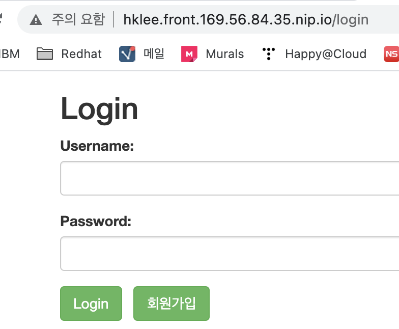

# mvp sample front
mvp sample front 서비스입니다.   
아래와 같이 cluster에 배포하십시오.   

# 사전준비
- k8s cluster에 연결된 PC나 VM에 접근하십시오. 
- [run-cicd 파이프라인](https://happycloud-lee.tistory.com/195?category=832250) 다운로드 
```
$ cd ~
$ git clone https://github.com/happyspringcloud/run-cicd.git
```

- namespace변수를 만듭니다. 아래 예 참조하여 적절히 변경하세요. 
```
$ export NS=mvp-sample
```

# git clone   
작업디렉토리를 만들고 git clone합니다.  
```
$ mkdir -p ~/work   
$ cd ~/work   
$ git clone https://github.com/happykube/mvp-sample-front.git
$ cd mvp-sample-front
```

# namespace 생성 & 현재 namespace 변경      
```
$ kubectl create ns ${NS}   
$ kubectl config set-context $(kubectl config current-context) --namespace ${NS}
```

# mvp-sample-front microservice 배포
- cicd디렉토리 하위의 cicd-common.properties, cicd-dev.properties, cicd-prod.properties파일 수정 

- run-cicd 실행하고, 값을 적절히 입력 
```
$ cd ~/work/mvp-sample-front
$ run-cicd
```

- Pod실행여부 확인
```
$ kubectl get po
```

- Ingress주소로 웹브라우저에서 확인
```
$ kubectl get ing
```
http://{ingress url}/login으로 접근합니다.   


# Next Action
- [mvp-sample-bizlogic](https://github.com/happykube/mvp-sample-bizlogic.git)을 배포하십시오.

